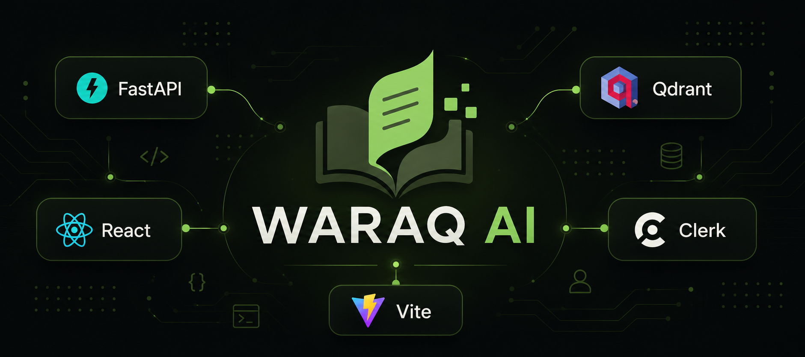
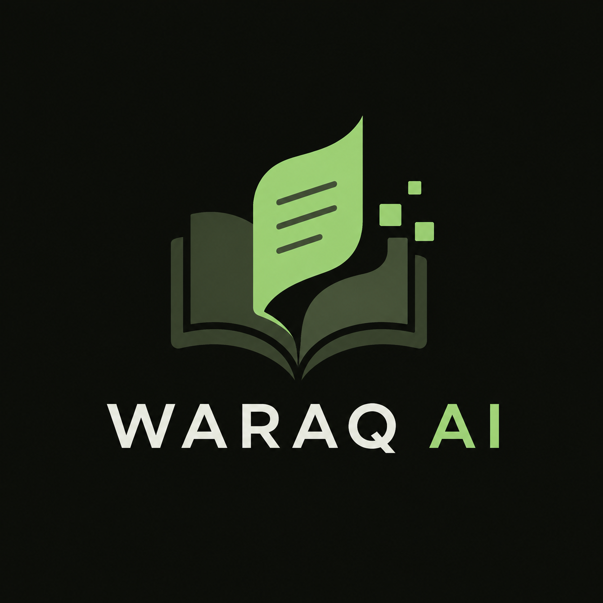
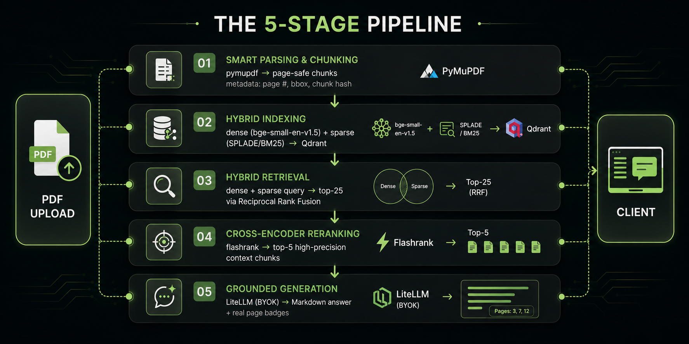

<p align="center">
  
</p>

<p align="center">
  <b>Waraq AI</b> — Intelligent Document Retrieval with Pinpoint Citations.
</p>

<p align="center">
  <a href="#features"></a>
  <a href="#features"></a>
  <a href="#features"></a>
  <a href="#features"></a>
  <a href="LICENSE"></a>
  <a href="docs/DEPLOYMENT.md"></a>
</p>

---

## What is Waraq AI?

Most RAG implementations fail in production: **hallucinated answers, poor recall on exact terms, and citations that can't be verified.** Waraq AI bridges the "toy RAG vs production RAG" gap with a 5-stage pipeline where **every claim traces to a real PDF page + bounding box** — not a made-up source.

<p align="center">
  
</p>

| | |
|---|---|
| 🎯 **Verifiable answers** | Every answer carries real page numbers + PDF coordinates — no hallucinated sources |
| 🔍 **Hybrid retrieval** | Dense embeddings + sparse BM25 fused with Reciprocal Rank Fusion (RRF) |
| 🎯 **Reranking precision** | Cross-encoder reranks 25 candidates → top-5 high-precision context chunks |
| 🔐 **Multi-tenant** | Clerk auth — users only see their own documents |
| 🛡️ **Local & private** | Embeddings run on your machine (FastEmbed ONNX) — zero data egress for indexing |
| 🔑 **BYOK** | Bring your own key — DeepSeek / Gemini / OpenAI / Anthropic / OpenRouter, swap via settings |

---

## The 5-Stage Pipeline

<p align="center">
  
</p>

---

## Features

### Core RAG
- **Page-boundary-safe chunking** — a chunk never spans two pages, so every citation maps to exactly one page
- **Hybrid search** — dense (bge-small-en-v1.5, 384-d) + sparse (BM25) in one Qdrant collection, fused server-side with RRF
- **Cross-encoder reranking** — flashrank (ONNX, no torch in base install)
- **Deterministic citations** — `page_number` + bounding-box coordinates on every source

### Multi-tenant (production-ready)
- **Clerk auth** — JWT verified against Clerk's JWKS; `user_id` filters every query, upload, and listing
- **Document isolation** — users can only search and list their own documents
- **SSE streaming auth** — `?token=` query param for EventSource

### App
- **Notebook-style resources** — select specific documents to chat with (NotebookLM-style scoped search)
- **Web search toggle** — optional Tavily / Brave grounding alongside your docs
- **BYOK LLM settings** — set provider + key at runtime from the UI (never round-trips the key)
- **Streaming answers** — SSE with live status events + citation cards
- **Multi-file upload** — batch PDF ingestion

---

## Tech Stack

| Layer | Choice |
|---|---|
| API | FastAPI + Pydantic v2, async throughout |
| Vector DB | Qdrant — named dense + sparse vectors |
| Embeddings | FastEmbed local — `BAAI/bge-small-en-v1.5` (384-d) + BM25 (sparse) |
| Reranking | flashrank `ms-marco-MiniLM-L-12-v2` (ONNX, no torch) |
| LLM | LiteLLM — **BYOK**: deepseek / gemini / openai / anthropic / openrouter |
| Auth | Clerk (multi-tenant JWT) |
| Frontend | React 19 + Vite |
| Web Search | Tavily / Brave (optional, BYOK) |

---

## Quickstart (Local Dev)

**Prereqs:** Python 3.11+, Docker (for Qdrant), Node 18+ (frontend), a Clerk app (optional for auth).

```bash
# 1. Vector store
docker compose up -d                 # Qdrant on localhost:6333

# 2. Backend
python -m venv .venv
.venv\Scripts\activate               # or: source .venv/bin/activate
pip install -e ".[dev]"
copy .env.example .env               # fill in LLM key + Clerk secret key

# 3. Run backend
uvicorn app.main:app --reload        # http://localhost:8000/docs

# 4. Frontend (optional)
cd frontend
npm install
npm run dev                          # http://localhost:5173
```

> Without a Clerk secret key, the API returns `401` on protected routes — set
> `WARAQAI_CLERK_SECRET_KEY` in `.env` (or run the tests, which bypass auth).

---

## Testing

```bash
pytest                  # 55 tests — unit + integration against Dockerized Qdrant
```

Integration tests skip cleanly when Qdrant isn't running. Auth is bypassed via a FastAPI dependency override; tenant isolation is covered by dedicated tests (user A can never see user B's documents).

---

## Deployment

Waraq AI deploys as two services: **FastAPI on Render** + **React on Netlify**, backed by **Qdrant Cloud**.

```
Browser (Netlify)  ──Bearer JWT──▶  Render (FastAPI)  ──▶  Qdrant Cloud
        ▲                                                       │
        └─────────── Clerk (auth) ◀─────────────────────────────┘
```

- [`render.yaml`](render.yaml) — Render Blueprint (backend + env vars)
- [`frontend/netlify.toml`](frontend/netlify.toml) — Netlify build + SPA redirect
- [`docs/DEPLOYMENT.md`](docs/DEPLOYMENT.md) — full step-by-step guide (Qdrant Cloud → Clerk → Render → Netlify)

---

## API Contract

The API is **frozen** in [`docs/api-contract.md`](docs/api-contract.md):

| Endpoint | Method | Purpose |
|---|---|---|
| `/api/upload-doc(s)` | POST | Ingest PDF(s), tagged with the user's `user_id` |
| `/api/documents` | GET | List the current user's indexed documents |
| `/api/query` | POST | Hybrid search → rerank → grounded answer + `sources[]` |
| `/api/stream-query` | GET (SSE) | Streaming answer: `status` → `answer_delta` → `done` |
| `/api/settings` | GET/PUT | BYOK LLM provider + key (never returns the key) |
| `/api/settings/search` | PUT | Tavily / Brave web-search key |
| `/health` | GET | Liveness + Qdrant connectivity |

Interactive docs at `/docs` (Swagger UI) when the server runs.

---

## Documentation

| File | Purpose |
|---|---|
| [`docs/architecture.md`](docs/architecture.md) | The 5-stage pipeline + locked technical decisions |
| [`docs/api-contract.md`](docs/api-contract.md) | Frozen API interface (both app halves build against it) |
| [`docs/DEPLOYMENT.md`](docs/DEPLOYMENT.md) | Deploy guide: Qdrant Cloud → Clerk → Render → Netlify |

**Status: M1–M8 complete.** Next: Select-from-Resources dialog, OCR for scanned PDFs, document deletion UI.

---

## Project Structure

```
waraq-ai/
├── app/
│   ├── api/routes/rag.py      # all API endpoints
│   ├── core/                  # config, logging, qdrant client, clerk auth
│   ├── models/                # Pydantic v2 schemas
│   └── services/              # ingestion, indexing, retrieval, reranking, generation, websearch
├── frontend/                  # React + Vite
├── docs/                      # architecture, contract, deployment
├── tests/                     # 55 tests (unit + integration)
├── assets/                    # brand images (logo, tech-stack diagram)
├── docker-compose.yml         # Qdrant
├── render.yaml                # Render Blueprint (backend)
└── pyproject.toml             # dependencies (no torch in base install)
```

---

## Roadmap

- [x] **M1** Project scaffold + sync architecture
- [x] **M2** Ingestion engine (pymupdf, page-safe chunking)
- [x] **M3** Hybrid indexing (dense + sparse → Qdrant)
- [x] **M4** Hybrid retrieval (RRF) + reranking
- [x] **M5** FastAPI endpoints (upload / query / SSE)
- [x] **M6** React frontend
- [x] **M7** Notebook/Resources scoped chat (backend done)
- [x] **M8** Clerk multi-tenant auth + deployment configs
- [ ] **M7 frontend** Select-from-Resources dialog
- [ ] OCR for scanned PDFs
- [ ] Document deletion UI

---

## Author

**M. Ahsaan Ullah**  
*Built as a flagship portfolio piece demonstrating full-stack ownership and production-grade AI integration.*

---

## License

MIT — see [LICENSE](LICENSE).
